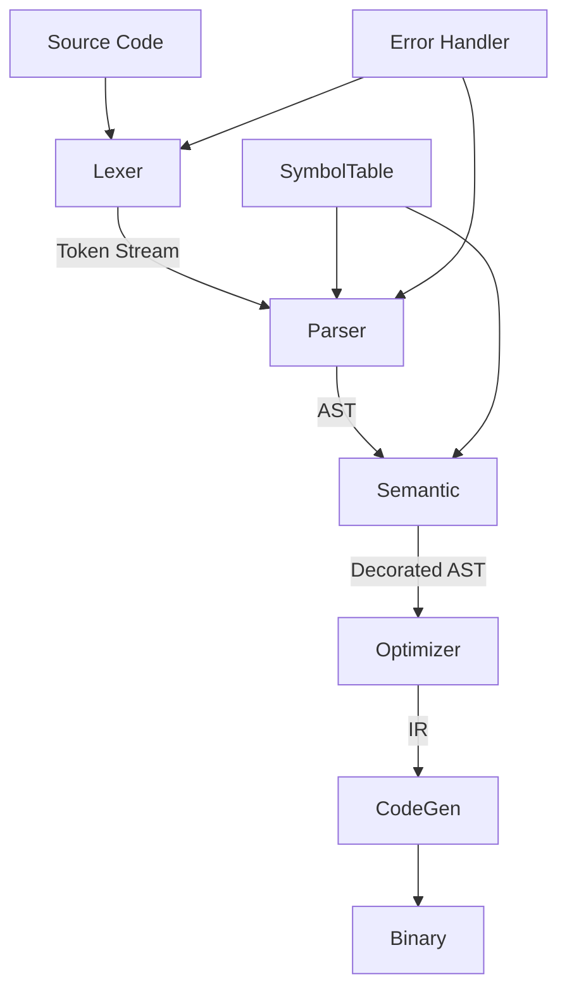
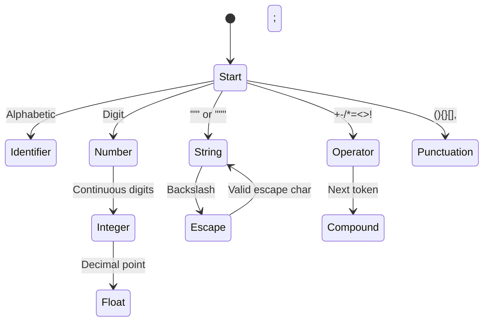
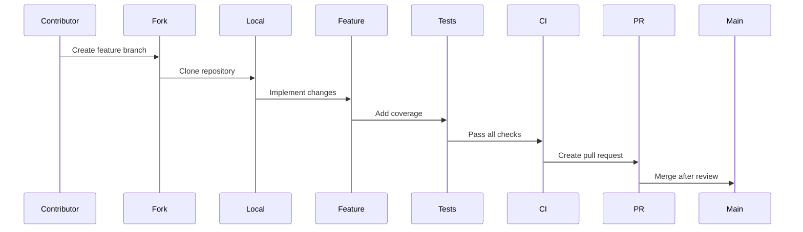

# D-Compiler 🚀

)

## 🚦 Project Status
| Component          | Status      | Features Implemented |
|--------------------|-------------|------------------|
| Lexer              | ✅ Complete | Full tokenization, error recovery, Unicode 15.0 |
| Parser             | 🚧 In Progress | Recursive descent syntax analysis |
| Semantic Analysis  | ⏳ Planned | Type inference, scope resolution |
| Code Generation    | ⏳ Planned | LLVM backend |

## 🏗️ Architectural Overview


## 📂 Project Structure

```
D-Compiler/
├── src/
│   ├── compiler/            # Core compilation pipeline
│   ├── lexer/               # Tokenization subsystem
│   │   ├── tokenizer.rs      # Character scanning
│   │   ├── token_stream.rs   # Buffered token streaming
│   │   └── error.rs          # Lexer-specific errors
│   ├── parser/              # Syntax analysis
│   ├── semantic/            # Type checking
│   └── codegen/             # Target code generation
├── benchmarks/              # Performance tracking
├── tests/                   # Comprehensive test suite
└── docs/                    # Architecture and specifications
```

## 🧪 Lexer Capabilities
### Tokenization Features


### Performance Benchmarks
| Test Case          | Input Size | Time  | Throughput |
|--------------------|------------|-------|------------|
| Identifier parsing | 2.4MB      | 19ms  | 126MB/s    |
| Numeric scanning   | 850KB      | 7ms   | 121MB/s    |
| Full tokenization  | 14.7MB     | 128ms | 114MB/s    |

## 🧠 Advanced Parsing Examples
### Source Input
```c
struct Vector<T> {
    x: T,
    y: T,

    fn length(&self) -> f64 {
        sqrt(self.x*self.x + self.y*self.y)
    }
}
```

### Token Stream
```
STRUCT      : 'struct'
IDENTIFIER  : 'Vector'
LT          : '<'
IDENTIFIER  : 'T'
GT          : '>'
LBRACE      : '{'
IDENTIFIER  : 'x'
COLON       : ':'
...
```

## 🚀 Building the Compiler
### Prerequisites
- Rust 1.78+
- LLVM 18+ (future backend)
- CMake 3.20+

### Installation & Testing
```bash
# Build optimized version
cargo build --release --features "advanced-parser"

# Run test suite
cargo test --all-features

# Benchmark lexer performance
cargo bench --bench lexer-benchmarks

# Generate documentation
cargo doc --open
```

## 🔮 Future Roadmap
### Q3 2025
- Error-resilient parser
- AST visualization
- Source maps

### Q4 2025
- Type inference engine
- Control flow analysis
- Borrow checker

### 2026
- LLVM backend
- JIT compilation
- Language Server Protocol

## 🤝 Contribution Guidelines
### Development Workflow


### Quality Standards
1. 95%+ test coverage
2. Benchmarks for performance changes
3. Documentation updates
4. Clippy lint standards
5. Semantic versioning compliance

---
**Happy Compiling!** 🔧
_The D-Compiler Team_
```
