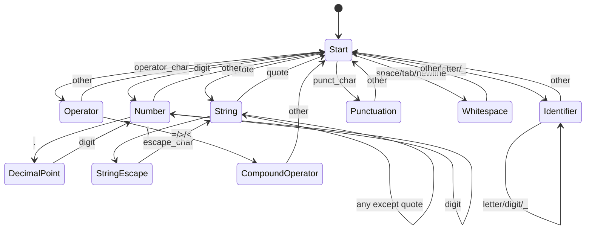
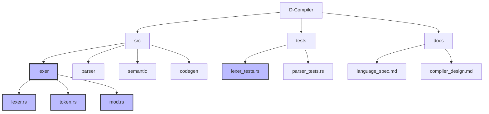
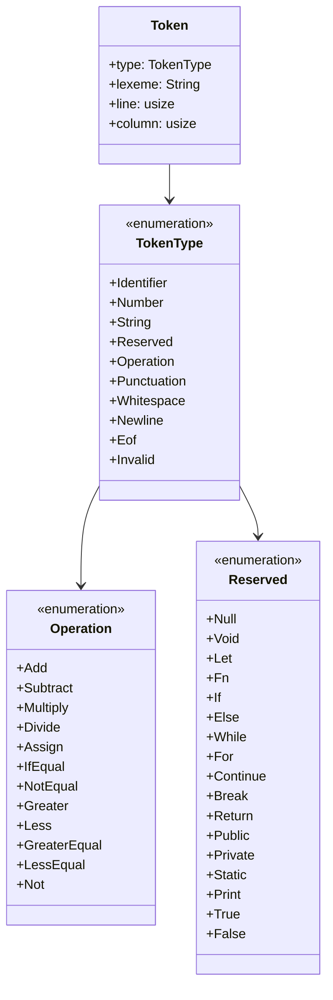

# D-Compiler

[](LICENSE)

A modern compiler implementation written in Rust for a custom programming language called D.

## Compiler Pipeline

```mermaid
graph LR
    A[Source Code] --> B[Lexer]
    B --> C[Parser]
    C --> D[Semantic Analyzer]
    D --> E[IR Generator]
    E --> F[Optimizer]
    F --> G[Code Generator]
    G --> H[Binary Output]
    
    style A fill:#f9f,stroke:#333,stroke-width:2px
    style B fill:#bbf,stroke:#333,stroke-width:4px
    style C fill:#ddd,stroke:#333,stroke-width:2px
    style D fill:#ddd,stroke:#333,stroke-width:2px
    style E fill:#ddd,stroke:#333,stroke-width:2px
    style F fill:#ddd,stroke:#333,stroke-width:2px
    style G fill:#ddd,stroke:#333,stroke-width:2px
    style H fill:#bfb,stroke:#333,stroke-width:2px
```



## Lexer State Machine



## Project Overview

This project aims to build a full-featured compiler that translates D programming language source code into executable programs. D is designed to be a modern, expressive programming language with strong static typing and modern programming features.

## Current Status

✅ = Completed
🚧 = In Progress
⏳ = Planned

### Compiler Phases

#### 1. Frontend
- ✅ Lexical Analysis (Tokenization)
  - Implemented token types (identifiers, keywords, operators, etc.)
  - Comprehensive test suite for lexer functionality
  - Support for string literals with escape sequences
  - Proper handling of numbers, identifiers, and whitespace
  - Error reporting for invalid tokens
- ⏳ Syntax Analysis (Parsing)
  - Abstract Syntax Tree (AST) design
  - Grammar definition
  - Parser implementation
  - Error recovery
- ⏳ Semantic Analysis
  - Symbol table implementation
  - Type checking
  - Scope resolution
  - Static analysis

#### 2. Middle-end
- ⏳ Intermediate Representation (IR)
  - IR design
  - IR generation
  - IR optimization passes
- ⏳ Code Optimization
  - Common optimizations
  - Dead code elimination
  - Constant folding
  - Loop optimization

#### 3. Backend
- ⏳ Code Generation
  - Target architecture selection
  - Assembly generation
  - Register allocation
  - Instruction selection
- ⏳ Binary Generation
  - Object file generation
  - Linking
  - Executable generation

### Language Features

Current implemented language features include:
- Basic lexical structure
- Operators: arithmetic, comparison, logical
- Control structures: if, else, while, for
- Functions and basic declarations

## Getting Started

### Prerequisites

- Rust (latest stable version)
- Cargo (comes with Rust)

### Building

```bash
cargo build
```

### Running Tests

```bash
cargo test
```

## Project Structure



## Token Structure



## Future Tasks

### Short-term Goals
- [ ] Implement basic parser
- [ ] Design and implement AST structures
- [ ] Add parser test suite
- [ ] Implement basic symbol table
- [ ] Add semantic analysis framework

### Mid-term Goals
- [ ] Design intermediate representation
- [ ] Implement basic optimizations
- [ ] Add type system
- [ ] Implement error recovery
- [ ] Add source location tracking

### Long-term Goals
- [ ] Code generation for x86_64
- [ ] Multiple target architecture support
- [ ] Advanced optimizations
- [ ] Standard library implementation
- [ ] Language specification documentation

## Language Syntax (Planned)

```d
// Function declaration
fn add(a: int, b: int) -> int {
    return a + b;
}

// Variable declaration
let x: int = 42;

// Control structures
if x > 0 {
    print("Positive");
} else {
    print("Non-positive");
}

// Loops
while x > 0 {
    x = x - 1;
}

// Basic types
let i: int = 42;
let f: float = 3.14;
let s: string = "Hello";
let b: bool = true;
```

## Contributing

Contributions are welcome! Please feel free to submit a Pull Request.

## License

This project is licensed under the Apache License 2.0 - see the [LICENSE](LICENSE) file for details.

## Acknowledgments

- The Rust programming language community
- Various compiler design resources and textbooks
- Open source compiler projects that served as inspiration

## Contact

GitHub Issues: Please use the issue tracker for bug reports and feature requests.